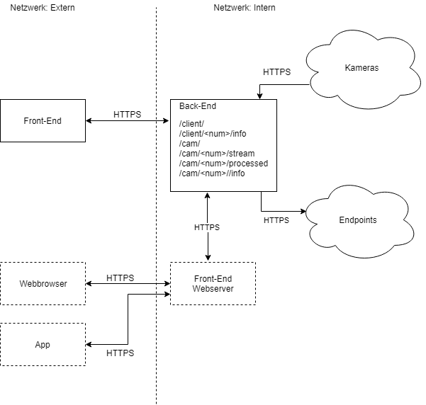

# IoI Interaktion ohne Interaktion 
##### (Demo)

Dieses Projekt enthält alle Komponenten eines Systems zu überwachung und Analyse mehrerer Videostreams und der Steuerung von Geräten auf Basis der Analyse.

### Struktur:
Pfad | Beschreibung
----|--- 
./FrontEnd/ | Enthält den Front-End Client. Geschrieben in C#.
./client/ | Ein simpler Flask (Python) Endpoint der als Demo Endpoint dient
./server/ | Enthält alle Dateien für Das Backend
./server/cams.json | Entält Informationen über die genutzen Videostreams, kann als Teil der Datenbank verstanden werden
./server/clients.json |   Entält Informationen über die möglichen Endpoints, kann als Teil der Datenbank verstanden werden
./server/Dockerfile | Enthält die Deployment Beschreibung. Kann als Prod. Env genutzt werden. Nutzt in diesem Fall aber nur die CPU
./server/model.pb | Enthält das genutzte vortrainierte Neuronale Netz
./server/motion_detector_old.py | Ein erster Prototyp eines rein OpenCV basierten Ansatzes
./server/requirments.txt | Enthält die pip Abhängigkeiten, wird von Dockerfile genutzt
./server/detector.py | Stellt die detection API die vom Server genutzt wird. Hier wird das NN ausgeführt
./server/app.py | Ein Flask Server. Nutzt detector.py um Personen in Videos zu erkennen. Bietet mehrere Routen, mehr hierzu weiter unten.

### Routes

    /client/ 				returns client list as json
    /client/<num>/info		returns client information as json
    /cam/					returns camera list as json
    /cam/<num>/stream       returns a unedited mjpeg stream
    /cam/<num>/processed    returns a mjpeg stream with persons highlighted
	        /info 			returns camera infromation

### Architektur

